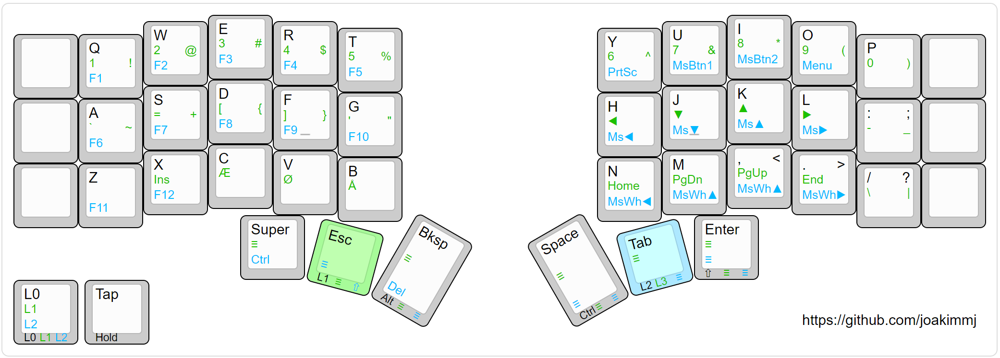

# CRKBD

## [3x5](./3x5)

> Image is generated using www.keyboard-layout-editor.com ([raw data](./3x5/assets/3x5.kle.json))

For testing the layout with [VIA](https://usevia.app/), use [3x5.via.json](./3x5/assets/3x5.via.json).

If wanting to flash the firmware, the `.hex` file can be found [here](./3x5/assets/crkbd_rev1_joakimmj-3x5.hex).
