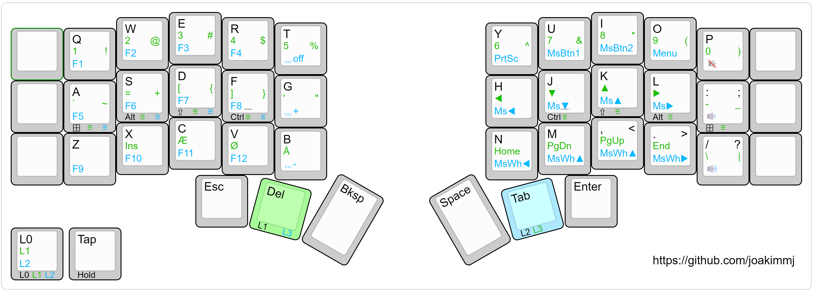

# CRKBD

## [3x5 Home Row Mods](./3x5-home-row-mods)

> Image is generates using www.keyboard-layout-editor.com ([raw data](./3x5-home-row-mods/assets/3x5-home-row-mods.kle.json))

For testing the layout with [VIA](https://usevia.app/), use [3x5-home-row-mods.via.json](./3x5-home-row-mods/assets/3x5-home-row-mods.via.json).
Remember that you might feel ... due to .. setup correct.. blah blah

If wanting to flash the firmware, the `.hex` file can be found [here](./3x5-home-row-mods/assets/crkbd_rev1_joakimmj-3x5-home-row-mods.hex).

