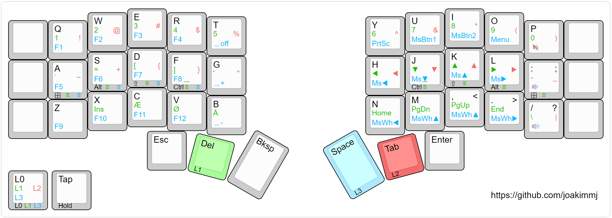

# CRKBD

## [3x5](./3x5)

### V1

> Image is generated using www.keyboard-layout-editor.com ([raw data](./3x5/v1/assets/3x5.kle.json))

For testing the layout with [VIA](https://usevia.app/), use [3x5.via.json](./3x5/v1/assets/3x5.via.json).

If wanting to flash the firmware, the `.hex` file can be found [here](./3x5/v1/assets/crkbd_rev1_joakimmj-3x5.hex).

### V2

> Image is generated using www.keyboard-layout-editor.com ([raw data](./3x5/v2/assets/3x5.kle.json))

For testing the layout with [VIA](https://usevia.app/), use [3x5.via.json](./3x5/v2/assets/3x5.via.json).

If wanting to flash the firmware, the `.hex` file can be found [here](./3x5/v2/assets/crkbd_rev1_joakimmj-3x5.hex).

## [3x5 Home Row Mods](./3x5-home-row-mods)

### V1

> Image is generated using www.keyboard-layout-editor.com ([raw data](./3x5-home-row-mods/v1/assets/3x5-home-row-mods.kle.json))

For testing the layout with [VIA](https://usevia.app/), use [3x5-home-row-mods.via.json](./3x5-home-row-mods/v1/assets/3x5-home-row-mods.via.json).

If wanting to flash the firmware, the `.hex` file can be found [here](./3x5-home-row-mods/v1/assets/crkbd_rev1_joakimmj-3x5-home-row-mods.hex).

### V2

> Image is generated using www.keyboard-layout-editor.com ([raw data](./3x5-home-row-mods/v2/assets/3x5-home-row-mods.kle.json))

For testing the layout with [VIA](https://usevia.app/), use [3x5-home-row-mods.via.json](./3x5-home-row-mods/v2/assets/3x5-home-row-mods.via.json).

If wanting to flash the firmware, the `.hex` file can be found [here](./3x5-home-row-mods/v2/assets/crkbd_rev1_joakimmj-3x5-home-row-mods.hex).
